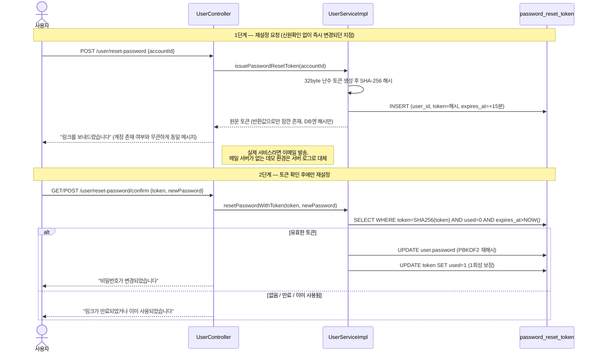

# Puppit (semi-project)

반려동물 용품 중고거래 웹 애플리케이션. 국비학원 3개월차 3인 팀 세미프로젝트를 완주한 뒤,
개인 포트폴리오용으로 **보안 하드닝 + 테스트/CI** 고도화를 진행 중인 저장소.

<!-- TODO: 스크린샷 또는 데모 GIF 삽입 (메인/로그인/재설정 흐름) -->

## 프로젝트 개요

- **원본**: 국비학원 팀 세미프로젝트 [`choimeeyoung94/semi-team-project`](https://github.com/choimeeyoung94/semi-team-project)
  (3인 팀, Spring MVC + MyBatis 기반 중고거래 플랫폼)
- **이 저장소**: 수료 후 커밋 히스토리를 정리하고 새로 시작, 개인 고도화 진행 (2026-09~)
- **팀 내 담당 / 이번 고도화 범위**: **로그인·회원가입(인증) 도메인** — 팀 프로젝트에서 직접 구현한 영역을
  실제 취약점 발견·수정, 테스트 작성까지 다시 손봄. 상세는 [내가 담당한 부분](#내가-담당한-부분--로그인회원가입-하드닝) 참고
- **자격증명 안내**: 원본 저장소가 public이라 기존 DB/Kakao/AWS/Iamport 키는 이미 노출된 상태.
  로컬 실행 시 아래 키들은 **재발급(rotate)** 후 사용할 것

## 기술 스택

- Java 11 (빌드 JDK 17 사용 가능), Spring MVC 5.3 (non-Boot, XML 설정), WAR / Tomcat 9
- MyBatis 3.5 + mybatis-spring, HikariCP, MySQL 8
- JSP + JSTL
- WebSocket + STOMP + SockJS (실시간 채팅/알림)
- AWS S3 (이미지), Kakao OAuth (소셜 로그인), Iamport/PortOne (포인트 결제)
- 테스트: JUnit 4 + Mockito

## 내가 담당한 부분 — 로그인/회원가입 하드닝

기존 코드를 심각도순으로 점검하며 실제로 동작하는 취약점 1건과 버그 3건, 방어 미흡 지점 3건을 찾아 수정했다.

| 심각도 | 이슈 | Before | After |
|---|---|---|---|
| 🔴 Critical | 비밀번호 재설정 계정 탈취 | `accountId`만으로 신원확인 없이 즉시 비밀번호 변경 | 일회용 토큰(15분 만료, 1회성) 발급 후에만 변경 |
| 🟠 Bug | 회원 탈퇴 NPE 위험 | null 체크보다 세션 값 사용이 먼저 실행됨 | null 체크를 먼저 수행하도록 순서 수정 |
| 🟠 Bug | 탈퇴 시 깨진 리다이렉트 | 오타(`rediredct:/userprofile`)로 500 에러 유발 | 정상 리다이렉트로 수정 |
| 🟡 Gap | 탈퇴 시 본인확인 부재 | 화면에 노출된 동의 문구 입력만으로 탈퇴 처리 | 현재 비밀번호 재확인 추가(소셜 로그인은 제외) |
| 🟡 Gap | 회원가입 서버측 검증 부실 | 빈 값 체크만, 클라이언트 JS 우회 시 무방비 | 비밀번호 정책·이메일 형식 등 서버측 정규식 검증 추가 |
| 🟢 Minor | 비밀번호 비교 타이밍 공격 이론적 가능성 | `String.equals()` | `MessageDigest.isEqual()` 상수시간 비교 |
| 🟢 Cleanup | 표준출력 직접 사용 | `printStackTrace()` / `System.out.println()` | slf4j 전환 + `logback.xml` 신규 |

흥미로운 지점은 **1번**이다: DB 스키마(`SCHEMA.sql`)에는 `password_reset_token` 테이블이 이미 설계돼 있었지만
애플리케이션 코드에서는 한 번도 연결된 적이 없었다 — 설계와 구현 사이의 괴리를 찾아 실제로 연결했다.



## 로컬 실행

빠른 경로 (Docker + Maven Wrapper):

```bash
cp .env.example .env
docker compose up -d          # MySQL + 스키마/시드 자동 적용

cp puppit/src/main/resources/application-secret.properties.example \
   puppit/src/main/resources/application-secret.properties
#   최소 db.* 만 채우면 됨 (Docker 기본값: root / puppit / db_puppit)

cd puppit && ./mvnw clean package     # Windows: .\mvnw.cmd clean package
#   → target/puppit-1.0.0.war 를 Tomcat 9 webapps/ 에 puppit.war 로 배치
#   → http://localhost:8080/puppit/
```

사전 요구사항, Docker 없이 실행, Kakao/S3/결제 키, 트러블슈팅은 **[docs/RUNNING.md](docs/RUNNING.md)** 참고.

## 테스트 & 빌드

```bash
./mvnw test              # 단위 테스트만
./mvnw clean package     # 빌드
```

- `UserServiceImpl` 대상 Mockito 단위 테스트 15개 — 회원가입 형식 검증, 로그인, 비밀번호 재설정 토큰
  (DB에는 해시만 저장되는지, 사용자 열거 방지, 1회성/만료 처리 포함), 회원 탈퇴, 비밀번호 재확인
- 기존 스모크 테스트 포함 총 16개 전체 통과, `mvnw clean package` 빌드(WAR ~33MB) 확인
- CI(GitHub Actions)는 아직 없음 — 다음 단계 참고

## 다음 단계

이번 고도화 중 발견했지만 **의도적으로 범위 밖에 남긴 것** (면접 기준까지 시간이 촉박해 우선순위를 조정함):

- CSRF 토큰 미적용 — `profile.jsp`에 `_csrf` 자리는 있으나 실제로 채워지지 않음(Spring Security 미도입)
- 로그인 무차별대입(brute-force) 방어 없음 — rate limit / 계정 잠금 미구현

그 외 전체 로드맵:

- [x] 빌드/실행 재현성: Maven Wrapper, `docker compose` 로 MySQL + 스키마/시드, `docs/RUNNING.md`
- [x] 로그인/회원가입 도메인 보안 하드닝 + 단위 테스트 (위 표 참고)
- [ ] GitHub Actions CI (`mvnw test` 자동 실행)
- [ ] 인증/인가를 Spring Security 로 통합, CSRF 방어, IDOR 제거
- [ ] 결제 웹훅 + 거래 동시성/보상 트랜잭션, 포인트 원장 테이블
- [ ] 전역 예외 처리(`@ControllerAdvice`), 나머지 도메인의 `System.out` 정리, 에러 페이지
- [ ] DB 인덱스/제약 정리
- [ ] (선택) Spring Boot 3 / Java 17 / Jakarta 마이그레이션
